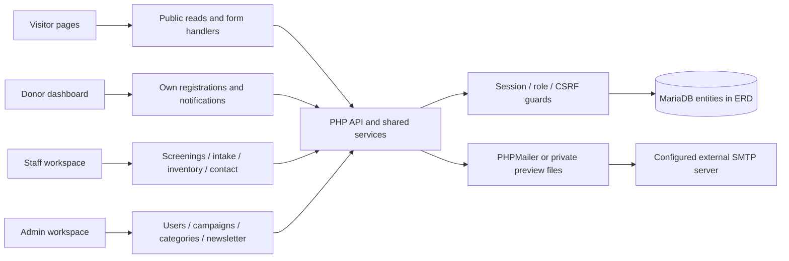

# HemoPulse ERD and API map

Generated from the installed MariaDB schema and the current PHP route/service code, October 4, 2026. Includes all 24 installed tables; no application records or credentials are included.

APIs are operations over entities, not database entities themselves. The ERD shows tables and relationships; the API map below shows how endpoints read and change them.

## Reading the ERD

PK = primary key; FK = enforced foreign key; UK = individually unique key. Nullable fields are labelled. A parent end `||` means exactly one and `o|` means zero or one. A child end `o{` means zero or many. Dotted `reviewed_by` is a PHP-managed relationship with no physical foreign key. Solid edges are database foreign keys; they do not mean cascade deletion.

`campaign_registrations.appointment_id`, `donation_records.appointment_id`, `donor_profiles.user_id`, and `donor_campaign_selection.user_id` enforce at most one child per parent. The appointment's compound active-booking unique index is an additional constraint, not a one-to-one donor/campaign relationship. Public reference columns are unique alternate identifiers, not foreign keys.

## Readable relationship views

Each view shows one parent and up to three child relationships, key fields, and labelled cardinalities. Start with roles and users, then campaigns, eligibility, appointments and donation provenance.

- [Accounts and roles](HEMOPULSE_ERD_1.svg)
- [User relationships · 1](HEMOPULSE_ERD_2.svg)
- [User relationships · 2](HEMOPULSE_ERD_3.svg)
- [User relationships · 3](HEMOPULSE_ERD_4.svg)
- [User relationships · 4](HEMOPULSE_ERD_5.svg)
- [User relationships · 5](HEMOPULSE_ERD_6.svg)
- [User relationships · 6](HEMOPULSE_ERD_7.svg)
- [Campaign categories](HEMOPULSE_ERD_8.svg)
- [Campaign registrations and selections](HEMOPULSE_ERD_9.svg)
- [Screening relationships](HEMOPULSE_ERD_10.svg)
- [Registration and clinical outcome](HEMOPULSE_ERD_11.svg)
- [Donation provenance](HEMOPULSE_ERD_12.svg)
- [Inventory provenance and allocation](HEMOPULSE_ERD_13.svg)
- [Contact reply history](HEMOPULSE_ERD_14.svg)
- [Retained recipient request relationships](HEMOPULSE_ERD_15.svg)

The printable HTML guide displays all these views and preserves the API map and complete dictionary.

```mermaid
erDiagram
    account_status_notices {
        int notice_id PK
        int user_id FK
        int changed_by FK "nullable"
        varchar old_status "nullable"
        varchar new_status
        varchar reason
        varchar recipient_email
        varchar delivery_status
        datetime created_at
    }
    appointments {
        int appointment_id PK
        int donor_id FK
        int campaign_id FK
        time scheduled_time_slot
        enum appointment_status
        varchar qr_pass_token UK
        varchar cancellation_reason "nullable"
        timestamp booked_at
        tinyint active_flag "nullable"
        varchar public_reference UK "nullable"
    }
    audit_logs {
        int log_id PK
        int user_id FK "nullable"
        varchar action_performed
        varchar affected_table
        int target_record_id "nullable"
        text old_value "nullable"
        text new_value "nullable"
        timestamp log_timestamp
        varchar client_ip_address "nullable"
        text details_json "nullable"
    }
    blood_inventory {
        int inventory_id PK
        enum blood_type
        int units_available
        int volume_ml_per_unit
        date collection_date
        date expiration_date
        enum inventory_status
        varchar public_reference UK "nullable"
    }
    blood_requests {
        int request_id PK
        int requester_id FK
        enum blood_type_requested
        int units_requested
        enum urgency_level
        enum request_status
        text clinical_justification "nullable"
        timestamp requested_at
    }
    campaign_categories {
        int category_id PK
        varchar name UK
        varchar description
    }
    campaign_registrations {
        int registration_id PK
        int appointment_id UK,FK
        int eligibility_id FK
        varchar full_name
        date date_of_birth
        varchar contact_number
        varchar email
        datetime requirements_agreed_at
    }
    campaigns {
        int campaign_id PK
        int created_by FK "nullable"
        varchar title
        text description "nullable"
        varchar location_venue
        date campaign_date
        time start_time
        time end_time
        int total_slots
        int available_slots
        int walk_in_capacity
        int target_units
        enum campaign_status
        timestamp created_at
        datetime registration_closes_at "nullable"
        int category_id FK "nullable"
    }
    contact_followups {
        int followup_id PK
        int message_id FK
        text message_body
        datetime received_at
    }
    contact_messages {
        int message_id PK
        varchar sender_name
        varchar email
        varchar subject
        text message_body
        enum message_status
        datetime received_at
        char thread_hash UK "nullable"
        datetime thread_expires_at "nullable"
    }
    contact_replies {
        int reply_id PK
        int message_id FK
        int replied_by FK
        text reply_body
        varchar delivery_status
        datetime replied_at
        char request_key UK "nullable"
    }
    donation_records {
        int donation_id PK
        int appointment_id UK,FK
        int verified_by_staff_id FK "nullable"
        date donation_date
        enum blood_type_collected "nullable"
        int volume_ml
        enum clinical_outcome
        text deferral_reason "nullable"
        text medical_notes "nullable"
    }
    donor_campaign_selection {
        int user_id PK,FK
        int eligibility_id FK
        int campaign_id FK
    }
    donor_profiles {
        int donor_profile_id PK
        int user_id UK,FK
        enum blood_type "nullable"
        date date_of_birth "nullable"
        decimal weight_kg "nullable"
        date last_donation_date "nullable"
        date estimated_eligible_date "nullable"
    }
    eligibility_checks {
        int eligibility_id PK
        int user_id FK
        enum outcome
        text answers_json
        text reasons_json
        datetime completed_at
        date deferred_until "nullable"
        datetime reviewed_at "nullable"
        int reviewed_by "nullable"
        varchar review_notes "nullable"
        date retry_after "nullable"
    }
    inventory_thresholds {
        int threshold_id PK
        enum blood_type UK
        int minimum_units
        int updated_by FK "nullable"
        timestamp updated_at
    }
    inventory_transactions {
        int transaction_id PK
        int inventory_id FK "nullable"
        int executed_by_staff_id FK "nullable"
        enum transaction_type
        int units_transacted
        int donation_id FK "nullable"
        int request_id FK "nullable"
        timestamp transaction_timestamp
        text transaction_notes "nullable"
        varchar public_reference UK "nullable"
    }
    login_attempts {
        bigint attempt_id PK
        char identity_hash
        datetime attempted_at
    }
    newsletter_subscriptions {
        int subscription_id PK
        varchar email UK
        enum subscription_status
        char token_hash UK "nullable"
        datetime token_expires_at "nullable"
        enum delivery_status
        datetime requested_at
        datetime confirmed_at "nullable"
        char unsubscribe_hash "nullable"
    }
    notifications {
        int notification_id PK
        int user_id FK
        enum notification_type
        varchar subject
        text message_body
        tinyint is_read
        timestamp sent_at
    }
    request_fulfillments {
        int fulfillment_id PK
        int request_id FK
        int inventory_id FK "nullable"
        int fulfilled_by_staff_id FK "nullable"
        int units_allocated
        timestamp fulfillment_date
    }
    request_limits {
        char limit_key PK
        bigint window_started
        int attempts
        bigint last_attempt
    }
    roles {
        int role_id PK
        enum role_name UK
    }
    users {
        int user_id PK
        int role_id FK "nullable"
        varchar email UK
        varchar password_hash
        varchar first_name
        varchar last_name
        varchar contact_number "nullable"
        enum account_status
        timestamp created_at
        varchar middle_name "nullable"
        varchar profile_image "nullable"
        varchar public_reference UK "nullable"
        varchar status_reason "nullable"
    }
    users ||--o{ account_status_notices : user_id
    users o|--o{ account_status_notices : changed_by
    campaigns ||--o{ appointments : campaign_id
    users ||--o{ appointments : donor_id
    users o|--o{ audit_logs : user_id
    users ||--o{ blood_requests : requester_id
    appointments ||--o| campaign_registrations : appointment_id
    eligibility_checks ||--o{ campaign_registrations : eligibility_id
    campaign_categories o|--o{ campaigns : category_id
    users o|--o{ campaigns : created_by
    contact_messages ||--o{ contact_followups : message_id
    contact_messages ||--o{ contact_replies : message_id
    users ||--o{ contact_replies : replied_by
    appointments ||--o| donation_records : appointment_id
    users o|--o{ donation_records : verified_by_staff_id
    users ||--o| donor_campaign_selection : user_id
    eligibility_checks ||--o{ donor_campaign_selection : eligibility_id
    campaigns ||--o{ donor_campaign_selection : campaign_id
    users ||--o| donor_profiles : user_id
    users ||--o{ eligibility_checks : user_id
    users o|--o{ inventory_thresholds : updated_by
    donation_records o|--o{ inventory_transactions : donation_id
    blood_inventory o|--o{ inventory_transactions : inventory_id
    blood_requests o|--o{ inventory_transactions : request_id
    users o|--o{ inventory_transactions : executed_by_staff_id
    users ||--o{ notifications : user_id
    blood_inventory o|--o{ request_fulfillments : inventory_id
    blood_requests ||--o{ request_fulfillments : request_id
    users o|--o{ request_fulfillments : fulfilled_by_staff_id
    roles o|--o{ users : role_id
    users o|..o{ eligibility_checks : reviewed_by_application_only
```

Complete physical ERD — all 24 tables

## API architecture

Google Maps on Contact is a browser embed, separate from the HemoPulse JSON API and database. It does not create campaign records. Web fonts and other browser assets are presentation dependencies, not database relationships.

## Implementation boundaries

- Admin, Staff and Donor are rows in `roles`; they are not separate user tables.
- Inventory provenance follows `donation_records → inventory_transactions → blood_inventory`. There is no direct donation_id column on blood_inventory. Completed intake creates a Pending unit and its Addition transaction; Deferred intake creates no unit and allows blood_type_collected=NULL.
- Eligibility reviewers use `eligibility_checks.reviewed_by → users.user_id` in code; this column has no database FK. It is the dotted ERD edge.
- `audit_logs.affected_table` and `target_record_id` form a generic audit pointer, not enforced foreign keys to every business table.
- Newsletter and contact emails are standalone strings, not user foreign keys. Visitors do not need an account to submit them.
- `blood_requests`, `request_fulfillments`, and `inventory_thresholds` are retained schema features with no active main API mutation routes. The old fulfillment handler returns HTTP 410. `login_attempts` is retained; current throttling uses `request_limits` and hashed identities.
- OTP data, session authentication, CSRF tokens, uploaded profile files, and private .eml previews are not database tables. SMTP/PHPMailer is an external transport, not an entity or HTTP API endpoint.
- GET inventory and staff GET reports perform automatic expiry updates; they are not completely read-only.
- Registration status transitions are Pending → Confirmed → Checked-In → Completed/Deferred; cancellation and No-Show follow the allowed branches. Completed intake rechecks the effective donation/deferral waiting date under the donor lock.
- Reply attempts are saved before SMTP. A stable request_key prevents duplicate sends on retry. Sending/Unknown states require manual transport-log reconciliation; Accepted means server acceptance, not inbox delivery.

## Main JSON API

Base URL: `/hemopulse/api/index.php/`. `{id}` is a positive internal numeric ID. Routes with `[/{id}]` use collection POST and item PUT/DELETE. Responses are JSON except reports with `format=csv`. Session cookies authenticate requests; non-GET main API requests require `X-CSRF-Token`. Public reads are session, campaigns, and categories. Unsupported methods return 405. No standalone GET item routes exist unless listed here.

| Method | Route | Access | Reads | Writes / effects |
|---|---|---|---|---|
| GET | session | Public | users, roles; PHP session | Creates/returns session CSRF token |
| GET | campaigns | Public; management scope: Admin/Staff | campaigns, campaign_categories | None |
| POST / PUT / DELETE | campaigns[/{id}] | Admin | campaigns, appointments, campaign_categories | campaigns; notifications on reschedule; donor_campaign_selection on delete; audit_logs |
| GET | categories | Public | campaign_categories | None |
| POST / PUT / DELETE | categories[/{id}] | Admin | campaign_categories, campaigns | campaign_categories, audit_logs |
| GET | audit-logs | Admin/Staff | audit_logs, users | None; paginated, actor/action/date filters |
| GET | users | Admin | users, roles, account_status_notices | None |
| POST / PUT / DELETE | users[/{id}] | Admin | users, roles | users, account_status_notices, audit_logs; status change queues notice; DELETE deactivates account |
| GET | appointments | Authenticated; donor sees own | appointments, campaigns, users | None |
| POST | appointments | Donor | users, roles, eligibility_checks, campaigns, appointments, donor_profiles, donation_records | appointments, campaign_registrations, campaigns capacity, audit_logs |
| PUT / DELETE | appointments/{id} | Admin/Staff; donor DELETE own only | appointments, campaigns, users | appointments, campaigns capacity on cancellation, notifications, audit_logs |
| GET | screenings | Admin/Staff | eligibility_checks, users | None |
| PUT | screenings/{id} | Admin/Staff | eligibility_checks, users, donor_profiles, donation_records, appointments | eligibility_checks, notifications, audit_logs |
| POST | donations | Admin/Staff | appointments, campaigns, eligibility_checks, donor_profiles, campaign_registrations, donation_records, users | donation_records, appointments, notifications, donor_profiles; Completed adds blood_inventory and inventory_transactions; Deferred updates eligibility_checks; audit_logs |
| GET | inventory | Admin/Staff | blood_inventory, inventory_transactions, donation_records, appointments, users, campaigns | Expiry detection can update blood_inventory and add inventory_transactions |
| PUT | inventory/{id} | Admin/Staff | blood_inventory | blood_inventory, inventory_transactions, audit_logs; also expiry detection |
| GET | transactions | Admin/Staff | inventory_transactions, blood_inventory, donation_records, appointments, users, campaigns | None |
| GET | messages | Admin/Staff | contact_messages | None |
| PUT | messages/{id} | Admin/Staff | contact_messages, contact_replies | contact_messages, contact_replies, audit_logs; SMTP or private preview for reply |
| GET | message-replies/{id} | Admin/Staff | contact_replies, contact_followups, users | None; id is message_id, not reply_id |
| GET | newsletter | Admin | newsletter_subscriptions | None; management list does not send newsletters |
| GET | notifications | Authenticated; own only | notifications | None; paginated |
| PUT | notifications/{id} | Authenticated; own only | notifications | notifications.is_read |
| GET | reports | Authenticated; donor limited to own | appointments, campaigns; staff additionally users, audit_logs, eligibility_checks, blood_inventory | Staff report can expire inventory; format=csv exports the report |

## Form handlers and compatibility endpoints

These are existing PHP endpoints, not additional REST resources. Form mutations generally use a hidden csrf field and may redirect; OTP and compatibility handlers return JSON.

| Endpoint | Access / purpose | Data or service |
|---|---|---|
| POST backend/login_handler.php; POST backend/auth_handler.php | Public login; auth_handler also logout | users, roles, request_limits; PHP sessions |
| POST backend/otp_handler.php | Public; send_otp / verify_otp | users, roles, request_limits; OTP pending data in PHP session; mail transport |
| POST backend/eligibility_handler.php | Donor | eligibility_checks, donor_profiles, donation_records, appointments, users, donor_campaign_selection |
| POST backend/campaign_selection.php | Donor | donor_campaign_selection, eligibility_checks, campaigns, users |
| POST backend/appointment_handler.php | Donor; action=book_slot | Same shared booking service as POST appointments |
| POST backend/donation_handler.php | Admin/Staff | Same shared intake service as POST donations |
| POST backend/profile_handler.php | Authenticated | users; private profile-image files |
| POST backend/notification_handler.php | Authenticated; own only | notifications |
| GET / POST contact_thread.php | Submitting browser session or private expiring token; POST requires CSRF | contact_messages, contact_replies, contact_followups, request_limits, audit_logs |
| POST backend/contact_handler.php | Public | contact_messages, request_limits, audit_logs |
| POST backend/newsletter_handler.php | Public | newsletter_subscriptions; confirmation mail |
| GET newsletter_confirm.php; GET newsletter_unsubscribe.php | Public with secret token | newsletter_subscriptions |
| GET profile_photo.php | Authenticated; own image | users; private profile-image files |
| backend/api/campaigns.php | Public compatibility listing | campaigns; different response/list ordering from main API |
| GET backend/api/inventory.php | Admin/Staff compatibility listing | blood_inventory, inventory_transactions; expiry detection |
| POST backend/api/appointments.php | Donor compatibility booking | Delegates to appointment_handler.php; supports JSON time alias |
| POST backend/fulfillment_handler.php | Admin/Staff; HTTP 410 | Disabled: recipient fulfillment is outside the current donor application |

## Source and regeneration

Schema: `deployment/schema.sql`, `database/user_flows.sql`, `database/portal.sql`, `database/revision.sql`, `database/migrate.php`, checked against installed metadata. APIs: `api/index.php`, `includes/api_*.php`, `includes/booking.php`, `includes/notifications.php`, and handlers listed above.

Run `php scripts/export_schema.php` to inspect current metadata; save its UTF-8 JSON output to `docs/erd-schema.json`, then run `python scripts/build_erd.py` to rebuild these artifacts. This guide is a schema and code inspection, not an API availability test.
